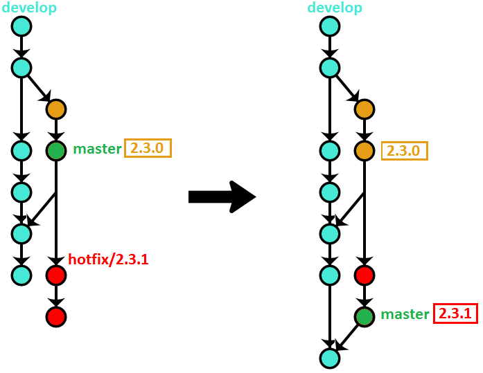

# Git branching strategy and workflow

It's a variation of OneFlow strategy. The aim is to have project history cleaner and more readable, and thus more useful.
The idea is to use two long-lived branches as the only source of true and start point to feature branches: `master` and `develop`.
The purpose of `master` branch is to point to the last released commit. Each time the version number is bumped, the latest branch is fast-forwarded to the newly created tag.
The `develop` branch is the starting point to all feature branches.

# Workflow

### 1. Starting new feature from `develop` branch

```sh
git checkout -b feat/one
```

### 2. Finishing new feature

```sh
git checkout feat/one
git rebase -i develop
git checkout develop
git merge --no-ff feat/one
git push origin develop
git branch -d feat/one
```

### 3. Release new feature

```
git checkout -b release/v1.0.0
git tag v1.0.0
git checkout develop
git merge release/v1.0.0
git push --tags origin develop
git branch -d release/v1.0.0
git checkout master
git merge --ff-only v1.0.0
git push origin master
```


### 4. Hotfix new feature

```
git checkout -b hotfix/v1.0.1 master
...
git tag v1.0.1
git checkout develop
git merge hotfix/v1.0.1
git push --tags origin develop
git branch -d hotfix/v1.0.1
git checkout master
git merge --ff-only v1.0.1
git push origin master
```


